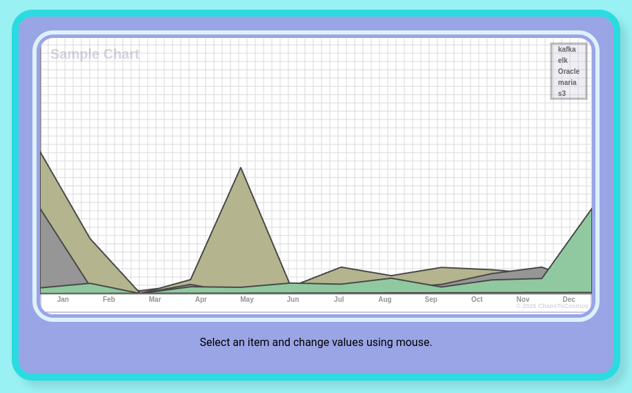

<div align="center">
    
</div>

--- 

<br/>
ChaosChart is a **React-based charting library** designed to create dynamic, interactive, and visually appealing charts. It supports multiple chart types and provides extensive customization options, making it ideal for data visualization in modern web applications.
<br/>
<br/>

<div align="center">
    
</div>

---

## ✨ Features

- **Multiple Chart Types**: Bar, Line, Area, Circle, and Bar Ratio charts.
- **Interactive Elements**: Modify chart values dynamically with mouse input.
- **Customizable Styles**: Style charts easily using modular CSS.
- **Color Picker Integration**: Interactively change colors for chart elements.
- **Legend and Grid Support**: Enhanced readability with grid lines, axis labels, and legends.
- **Export Options**: Save charts as image files.
- **Peak Display**: Option to highlight peaks in data points.
- **Data-Driven**: Fully configurable through structured JSON.

---

## 🚀 Getting Started

This project was bootstrapped with [Create React App](https://github.com/facebook/create-react-app).

### ✅ Prerequisites

Make sure you have the following installed:

- **Node.js** (v14 or later)
- **npm** (v6 or later)

### 📦 Installation

```bash
git clone https://github.com/chaoschart/chaoschart.git
cd chaoschart
npm install
npm start
```

---

## 📄 Sample Usage

Here is an example from `index.js` for rendering two charts:

```jsx
import React from 'react';
import ReactDOM from 'react-dom/client';

import ChartConstants from './chaoschart/ChartConstants.js';

import ChaosChart from './ChaosChart.jsx';
import ChaosChartTable from './ChaosChartTable.jsx';

import indexStyle from './index.module.css';
import defaultStyle from './DefaultChartStyle.module.css';

import json2 from './sample2.json';
import json from './sample.json';

const root = ReactDOM.createRoot(document.getElementById('root'));
const chartWidth = 800;
const chartHeight = 400;

root.render(
  <React.StrictMode>
    <div className={indexStyle.titleContainer}>
      <p> ChaosChart React Library<br/> v0.0.1</p>
      <p> ©️ All rights reserved by author Kooin Shin.</p>
    </div>

    <ChaosChart
      type={ChartConstants.CHART.AREA}
      width={chartWidth}
      height={chartHeight}
      config={json}
      readOnly={false}
      styles={defaultStyle}
    />

    <ChaosChartTable
      type={ChartConstants.CHART.LINE}
      width={chartWidth}
      height={chartHeight}
      config={json2}
      readOnly={false}
      styles={defaultStyle}
    />
  </React.StrictMode>
);
```

---

## 📊 Sample Chart Data (JSON)

```json
{
  "TITLE": "Sample Chart",
  "xIndex": ["Jan", "Feb", "Mar", "Apr", "May", "Jun", "Jul", "Aug", "Sep", "Oct", "Nov", "Dec"],
  "yIndex": [10, 20, 30, 40, 50, 60, 70, 80, 500],
  "IS_SHOW_GRID_Y": false,
  "IS_SHOW_GRID_X": false,
  "indent_left": 0,
  "INDENT_RIGHT": 0,
  "INDENT_TOP": 0,
  "INDENT_BOTTOM": 30,
  "LIMIT": 900,
  "LEGEND_FONT_SIZE": 8,
  "IS_SHOW_PEAK": true,
  "PEEK_STYLE": "RECTANGLE",
  "elements": {
    "kafka": {
      "color": "rgb(130,180,130)",
      "values": [44, 35, 0, 32, 0, 33, 29, 43, 25, 22, 32, 43]
    },
    "elk": {
      "color": "rgb(180,130,130)",
      "values": [150, 25, 10, 32, 0, 23, 52, 32, 32, 23, 54, 23]
    },
    "Oracle": {
      "color": "rgb(180,180,140)",
      "values": [500, 193, 0, 49, 444, 24, 93, 63, 92, 84, 69, 46]
    },
    "maria": {
      "color": "rgb(150,150,150)",
      "values": [300, 25, 0, 32, 0, 23, 9, 19, 32, 70, 93, 29]
    },
    "s3": {
      "color": "rgb(150,200,158)",
      "values": [20, 36, 0, 24, 22, 37, 33, 54, 23, 48, 53, 300]
    }
  }
}
```

---

## 📁 Project Structure

```
chaoschart/
├── ChaosChart.jsx
├── ChaosChartTable.jsx
├── ChaosChartInputElement.jsx
├── ChartConstants.js
├── DefaultChartStyle.module.css
├── index.module.css
├── sample.json
├── sample2.json
└── ...
```

---

## 🧑‍💻 Author

- Kooin Shin

---

## 📜 License

© All rights reserved by Kooin Shin. Please contact the author for licensing inquiries.
